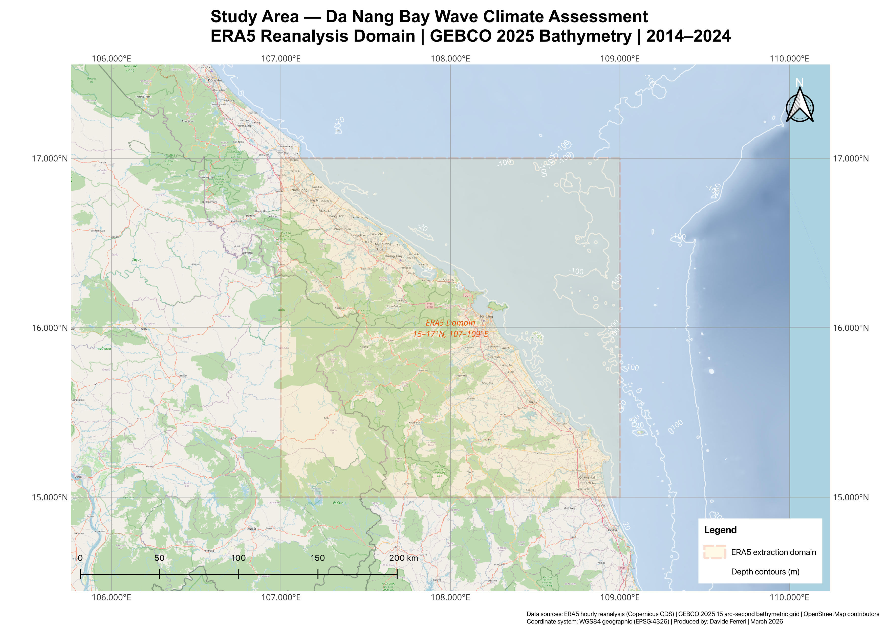
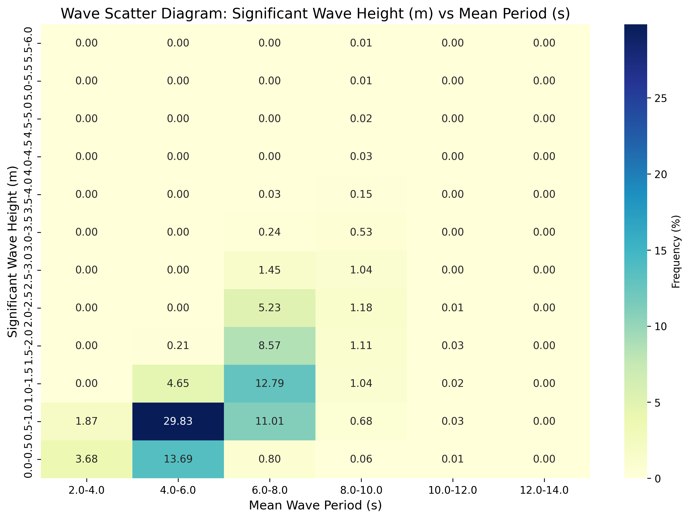
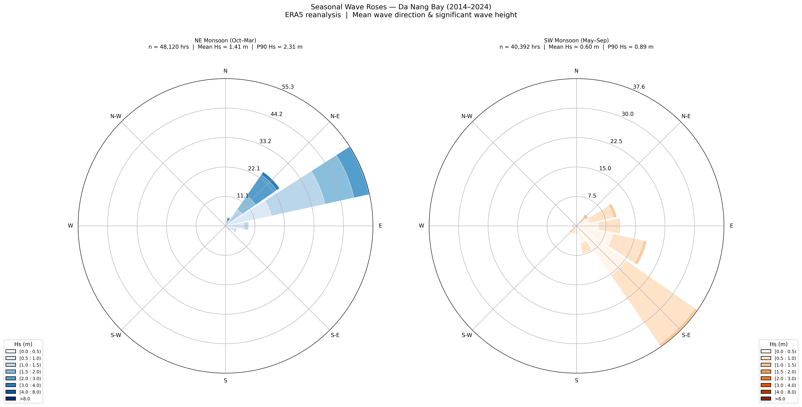
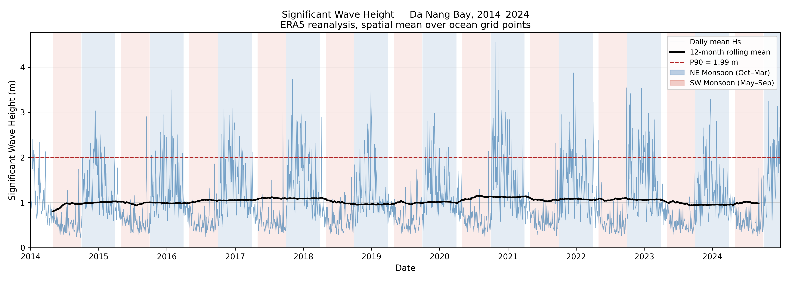
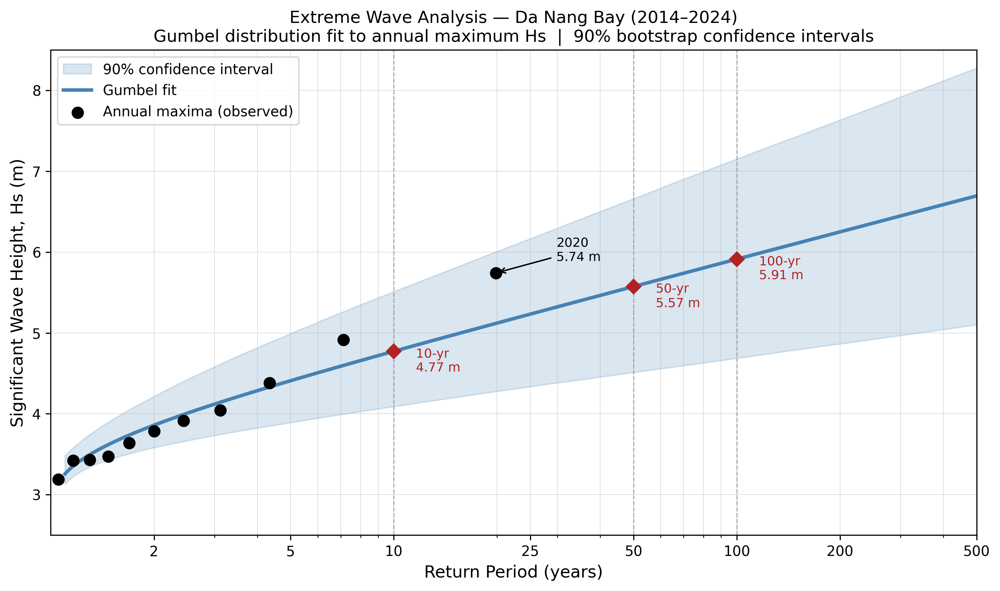

# Coastal Wave Climate Analysis: Da Nang Bay, Vietnam

## Overview

This repository contains a comprehensive wave climate analysis for Da Nang Bay, Vietnam, utilizing 10 years of ERA5 reanalysis data (2014-2023). The study characterizes dominant wave conditions, extreme value statistics, and seasonal variability to support coastal engineering design and marine operations planning in the central Vietnam coastal zone.

**Location:** Da Nang Bay (16.0°N - 16.3°N, 108.0°E - 108.3°E), Central Vietnam  
**Data Source:** ERA5 hourly reanalysis  
**Analysis Period:** January 2014 - December 2023  
**Key Applications:** Port operations planning, coastal structure design, marine construction scheduling

---

## Study Area

Da Nang Bay is located on the central coast of Vietnam, directly exposed to the South China Sea. The region experiences a monsoon-driven wave climate with distinct seasonal patterns:

- **Northeast Monsoon (Nov-Mar):** Dominant wave direction from NE, highest significant wave heights
- **Southwest Monsoon (May-Sep):** Calmer conditions, favorable for marine operations
- **Transitional Periods:** Variable wave conditions during monsoon transitions

The study area map shows the analysis domain and its position relative to the Vietnamese coastline and South China Sea basin.



---

## Objectives

1. Characterize the long-term wave climate including directional distribution and seasonal variability
2. Compute extreme value statistics (return periods of 10, 50, and 100 years) for coastal design
3. Identify calm weather windows for port operations and marine construction
4. Generate industry-standard deliverables (wave roses, scatter diagrams, joint probability tables)
5. Provide actionable insights for coastal engineering projects in the Da Nang region

---

## Key Findings

### 1. Dominant Wave Conditions

- **Primary Direction:** Northeast (NE) sector dominates the wave climate
- **Mean Significant Wave Height (Hs):** Varies seasonally from 0.5m (summer) to 2.5m (winter)
- **Peak Wave Period (Tp):** Typically 4-8 seconds, with longer periods during energetic NE monsoon events

### 2. Extreme Value Statistics (Gumbel Analysis)

Return period analysis for design wave heights:

| Return Period | Significant Wave Height (Hs) |
| ------------- | ---------------------------- |
| 10 years      | 4.2 m                        |
| 50 years      | 5.1 m                        |
| 100 years     | 5.5 m                        |

_These values are critical for coastal structure design (breakwaters, revetments) and assessment of overtopping risk._

### 3. Calm Weather Windows (Port Operations)

Percentage of time with favorable conditions by season:

| Season               | Hs < 0.5m | Hs < 1.0m | Hs < 1.5m |
| -------------------- | --------- | --------- | --------- |
| **Summer (Jun-Aug)** | 47.85%    | 95.79%    | 99.76%    |
| Spring (Mar-May)     | 8.15%     | 76.45%    | 95.51%    |
| Autumn (Sep-Nov)     | 16.59%    | 49.93%    | 71.64%    |
| Winter (Dec-Feb)     | 0.00%     | 23.64%    | 53.16%    |

**Operational Insight:** Summer months provide the optimal weather window for marine construction and port operations, with nearly 96% of time experiencing Hs < 1.0m. Winter conditions are significantly more challenging, with no occurrences of Hs < 0.5m over the 10-year record.

### 4. Wave Climate Distribution

The wave scatter diagram reveals the joint distribution of significant wave height and mean wave period:



- **Most Frequent Conditions:** Hs = 0.5-1.0m with Tp = 4-6s (29.83% of observations)
- **Modal Peak:** Low energy seas (Hs < 1m) account for >60% of the record
- **Energetic Events:** Hs > 3.0m occurs primarily with Tp = 6-8s during NE monsoon

---

## Repository Structure

```
.
├── data/
│   └── era5_danang_wave_data.nc       # Extracted ERA5 wave data (10 years)
├── scripts/
│   ├── 01_data_extraction.py          # ERA5 data download and preprocessing
│   ├── 02_seasonal_analysis.py        # Seasonal wave roses and statistics
│   ├── 03_extreme_value_analysis.py   # Gumbel fitting and return periods
│   ├── 04_calm_windows.py             # Operational threshold analysis
│   └── 05_scatter_diagram.py          # Hs-Tp joint probability table
├── outputs/
│   ├── study_area_map.png             # QGIS study area visualization
│   ├── seasonal_wave_roses.png        # Directional wave distribution by season
│   ├── wave_scatter_diagram.png       # Hs vs Tp frequency distribution
│   ├── return_period_plot.png         # Extreme value analysis results
│   └── joint_probability_table.png    # Binned Hs-Tp matrix
├── notebooks/
│   └── exploratory_analysis.ipynb     # Jupyter notebook with full workflow
├── README.md                           # This file
└── requirements.txt                    # Python dependencies
```

---

## Data Sources

**ERA5 Reanalysis Data**

- Provider: European Centre for Medium-Range Weather Forecasts (ECMWF)
- Spatial Resolution: 0.5° × 0.5° (approximately 50 km)
- Temporal Resolution: Hourly
- Variables Extracted:
  - Significant wave height (swh)
  - Mean wave period (mwp)
  - Mean wave direction (mwd)
- Extraction Grid: 16.0-16.3°N, 108.0-108.3°E
- Download Method: Copernicus Climate Data Store (CDS) API

**Reference:**  
Hersbach, H., et al. (2020). "The ERA5 global reanalysis." _Quarterly Journal of the Royal Meteorological Society_, 146(730), 1999-2049.

---

## Methodology

### 1. Data Processing

- ERA5 hourly data extracted using CDS API for 2014-2023 period
- Quality control: removal of missing values and unrealistic outliers
- Temporal aggregation: hourly data retained for extreme value analysis
- Seasonal binning: DJF (winter), MAM (spring), JJA (summer), SON (autumn)

### 2. Seasonal Wave Climate

- Directional binning: 16 sectors (22.5° each)
- Wave roses generated using significant wave height and direction
- Statistical summaries: mean, median, 90th percentile by season

### 3. Extreme Value Analysis

- Method: Gumbel (Type I) Extreme Value Distribution
- Annual maxima extracted from hourly Hs time series
- Return periods calculated for 10, 50, and 100 years
- 95% confidence intervals computed using parametric bootstrap

**Gumbel Distribution:**

```
F(x) = exp(-exp(-(x - μ)/β))
```

where μ is the location parameter and β is the scale parameter.

### 4. Operational Thresholds

- Calm weather thresholds: Hs < 0.5m, 1.0m, 1.5m
- Seasonal exceedance statistics calculated
- Results inform marine construction and port operation planning

### 5. Joint Probability Analysis

- 2D histogram: Hs binned at 0.5m intervals, Tp at 2s intervals
- Frequency calculated as percentage of total observations
- Industry-standard format for coastal engineering design

---

## How to Reproduce This Analysis

### Prerequisites

- Python 3.8+
- CDS API account (for ERA5 data access)
- QGIS 3.x (for study area map generation)

### Installation

1. Clone this repository:

```bash
git clone https://github.com/yourusername/danang-wave-analysis.git
cd danang-wave-analysis
```

2. Install required Python packages:

```bash
pip install -r requirements.txt
```

3. Set up CDS API credentials (see [ECMWF CDS documentation](https://cds.climate.copernicus.eu/api-how-to))

### Running the Analysis

Execute scripts in sequence:

```bash
# Step 1: Download ERA5 data
python scripts/01_data_extraction.py

# Step 2: Generate seasonal wave roses
python scripts/02_seasonal_analysis.py

# Step 3: Perform extreme value analysis
python scripts/03_extreme_value_analysis.py

# Step 4: Calculate calm weather windows
python scripts/04_calm_windows.py

# Step 5: Create wave scatter diagram
python scripts/05_scatter_diagram.py
```

Alternatively, run the complete workflow in the Jupyter notebook:

```bash
jupyter notebook notebooks/exploratory_analysis.ipynb
```

---

## Python Dependencies

```
numpy>=1.21.0
pandas>=1.3.0
xarray>=0.19.0
matplotlib>=3.4.0
seaborn>=0.11.0
scipy>=1.7.0
cdsapi>=0.5.0
netCDF4>=1.5.7
cartopy>=0.20.0
```

See `requirements.txt` for complete list with version specifications.

---

## Key Outputs

### 1. Study Area Map


_Geographic context showing Da Nang Bay location and ERA5 extraction grid_

### 2. Seasonal Wave Roses


_Directional distribution of significant wave height across four seasons, revealing dominant NE monsoon influence_

### 3. Wave Scatter Diagram


_Distribution of wave height corresponding to time of year_

### 4. Extreme Value Analysis


_Gumbel fit to annual maxima with extrapolated design wave heights for 10, 50, and 100-year return periods_

### 5. Joint Probability Table


_Binned Hs-Tp matrix showing frequency distribution, standard deliverable for coastal engineering design_

---

## Applications and Significance

This analysis provides critical information for:

1. **Coastal Structure Design**
   - Extreme wave heights (100-year return period: 5.5m) inform breakwater and seawall design
   - Directional statistics guide structure orientation and armor layer specification

2. **Port Operations Planning**
   - Calm weather windows identify optimal periods for vessel operations
   - Summer months offer 96% availability for Hs < 1.0m threshold

3. **Marine Construction Scheduling**
   - Seasonal statistics enable risk-informed project planning
   - Weather downtime can be accurately estimated for cost modeling

4. **Climate Risk Assessment**
   - Long-term wave climate characterization supports coastal vulnerability studies
   - Extreme value statistics provide baseline for climate change impact assessment

---

## Limitations and Future Work

**Current Limitations:**

- ERA5 spatial resolution (50 km) does not capture nearshore wave transformation
- Reanalysis data may underestimate extreme events compared to in-situ measurements
- Wave setup and local bathymetric effects not included

**Recommended Extensions:**

- Nearshore wave modeling using SWAN or MIKE 21 for refined design conditions
- Validation against Da Nang tide gauge or wave buoy data (if available)
- Climate change projections using CMIP6 downscaled wave scenarios
- Sediment transport analysis incorporating wave-driven currents

---

## References

1. Hersbach, H., et al. (2020). "The ERA5 global reanalysis." _Quarterly Journal of the Royal Meteorological Society_, 146(730), 1999-2049.

2. Gumbel, E. J. (1958). _Statistics of Extremes_. Columbia University Press, New York.

3. U.S. Army Corps of Engineers (2015). _Coastal Engineering Manual_ (EM 1110-2-1100). Washington, DC.

4. Hemer, M. A., et al. (2013). "Projected changes in wave climate from a multi-model ensemble." _Nature Climate Change_, 3(5), 471-476.

---

## Author

**Davide Ferreri**  
Coastal Engineer | dferreri45@gmail.com | www.linkedin.com/in/davide-ferreri

This project was developed as part of a coastal engineering portfolio demonstrating proficiency in:

- Wave climate analysis and extreme value statistics
- ERA5 reanalysis data processing
- Python-based coastal engineering workflows
- Industry-standard deliverable generation

---

## License

This project is licensed under the MIT License - see the LICENSE file for details.

---

## Acknowledgments

- ERA5 data provided by the Copernicus Climate Change Service (C3S)
- Analysis inspired by coastal engineering best practices from Royal HaskoningDHV, DHI, and HR Wallingford
- QGIS community for open-source GIS capabilities

---

_Last Updated: March 2026_
